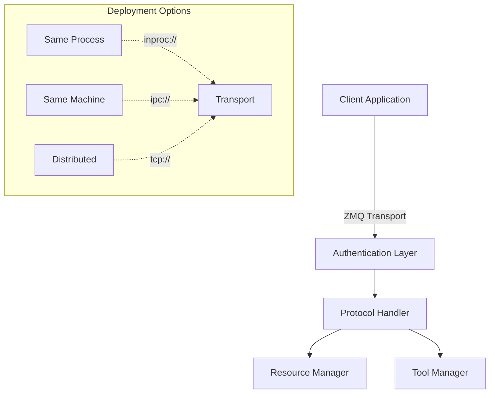

# MPC Remote: High-Performance Model Context Protocol

A ZeroMQ-based implementation of the Model Context Protocol optimized for performance, security, and deployment flexibility.

## Key Features

- **Decorator-Based API**: Simple and intuitive tool/resource registration
- **Type Inference**: Automatic parameter schema generation from type hints
- **Enhanced Security**: Built-in authentication and access control
- **High Performance**: Native ZMQ messaging with configurable patterns
- **Robust Error Handling**: Comprehensive error management and recovery
- **Protocol Extensions**: Authentication and versioning improvements

## Architecture



## Quick Start

### Installation
```bash
pip install mpc-remote

# Development install
pip install -e ".[dev]"
```

### Basic Usage

```python
from mpc_remote import MCPServer

# Create server
server = MCPServer()

# Register tools with decorators
@server.tool("add")
async def add(a: int, b: int) -> int:
    return a + b

# Register resources with decorators
@server.resource("user_data")
class UserData:
    def __init__(self):
        self.data = {}

    async def get(self, user_id: str) -> dict:
        return self.data.get(user_id, {})

# Configure security (optional)
@server.tool("analyze", consent_required=True)
async def analyze_data(data: dict) -> dict:
    return await process_data(data)

# Client usage
client = MCPClient("tcp://localhost:5555")
result = await client.execute_tool("add", {"a": 5, "b": 3})
```

## Advanced Features

### Type Hints and Schema Generation
```python
@server.tool("process")
async def process_data(
    input_data: List[float],
    threshold: float = 0.5,
    mode: str = "default"
) -> Dict[str, Any]:
    """
    Process input data with given parameters.
    Schema is automatically generated from type hints.
    """
    return {"result": await analyze(input_data, threshold, mode)}
```

### Consent and Authentication
```python
# Add consent handler
server.set_consent_handler(async def(tool_name, context):
    return await check_user_consent(context["user_id"], tool_name))

# Add authentication
server.set_auth_handler(async def(context):
    return await verify_token(context.get("token")))
```

### Resource Access Control
```python
@server.resource(
    "sensitive_data",
    access_level=ResourceAccessLevel.READ_WRITE,
    consent_required=True
)
class SensitiveData:
    """Access-controlled resource example"""
```

## Development

### Running Tests
```bash
# Install dev dependencies
pip install -e ".[dev]"

# Run tests
pytest tests/

# With coverage
pytest --cov=mpc_remote tests/
```

### Common Issues

1. **Connection Timeouts**
   - Check network connectivity
   - Verify correct endpoints
   - Check firewall settings

2. **Authentication Failures**
   - Verify token validity
   - Check permission configuration
   - Ensure auth provider is properly configured

3. **Performance Issues**
   - Adjust HWM for message queuing
   - Configure appropriate timeouts
   - Consider deployment pattern changes

## Contributing

See [CONTRIBUTING.md](CONTRIBUTING.md) for guidelines.

## License

MIT License - see [LICENSE](LICENSE) for details.
