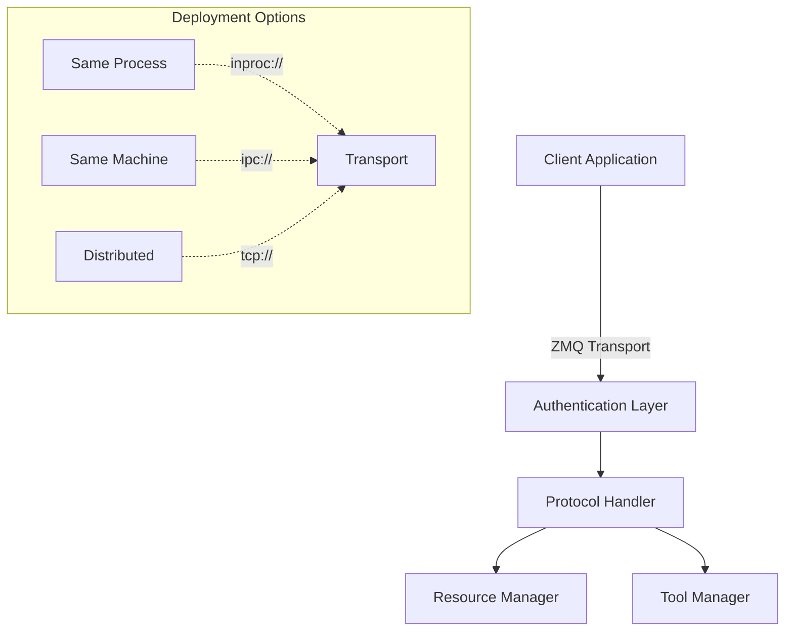

# MPC Remote: High-Performance Model Context Protocol

A ZeroMQ-based implementation of the Model Context Protocol optimized for performance, security, and deployment flexibility.

## Key Features

- **Flexible Deployment**: Run components in same process, same machine, or distributed
- **Enhanced Security**: Built-in authentication and access control
- **High Performance**: Native ZMQ messaging with configurable patterns
- **Robust Error Handling**: Comprehensive error management and recovery
- **Protocol Extensions**: Authentication and versioning improvements

## Architecture



## Quick Start

### Installation
```bash
pip install mpc-remote

# Development install
pip install -e ".[dev]"
```

### Basic Usage

```python
from mpc_remote import ZMQTransport, ProtocolHandler

# Server setup
server = ZMQTransport("tcp://*:5555", connection_type="bind")
handler = ProtocolHandler()

# Register tools/resources
handler.register_tool(Tool(
    name="analyze",
    implementation=analyze_func
))

# Client usage
client = ZMQTransport("tcp://localhost:5555")
result = await client.send_request({
    "method": "execute_tool",
    "params": {"tool": "analyze", "data": {...}}
})
```

## Deployment Patterns

### Same Process
Best for:
- Development and testing
- Resource-constrained environments
- Single-process applications

```python
# Server and client in same process
transport = ZMQTransport("inproc://app")
```

### Same Machine
Best for:
- Process isolation
- System services
- Security boundaries

```python
# IPC communication
transport = ZMQTransport("ipc:///tmp/app")
```

### Distributed
Best for:
- Cloud deployments
- Microservices
- Scale-out architectures

```python
# Network communication
transport = ZMQTransport("tcp://server:5555")
```

## Security

### Authentication
```python
from mpc_remote.security import AuthProvider

class JWTAuthProvider(AuthProvider):
    async def verify_token(self, token: str) -> bool:
        return jwt.verify(token, SECRET_KEY)
    
    async def check_tool_permission(self, token: str, tool: str) -> bool:
        claims = jwt.decode(token, SECRET_KEY)
        return tool in claims["permissions"]

handler = AuthenticatedProtocolHandler(JWTAuthProvider())
```

### Access Control
```python
# Resource with required permissions
resource = Resource(
    name="sensitive_data",
    access_level=ResourceAccessLevel.READ_WRITE,
    consent_required=True
)

# Tool with access control
tool = Tool(
    name="analyze",
    implementation=analyze_func,
    consent_required=True
)
```

## Performance Tuning

### Socket Options
```python
transport = ZMQTransport(
    "tcp://server:5555",
    recv_timeout=30.0,
    send_timeout=30.0,
    hwm=1000  # High water mark for message queuing
)
```

### Connection Management
```python
# Configure connection behavior
transport = ZMQTransport(
    "tcp://server:5555",
    reconnect_interval=1000,  # milliseconds
    max_retries=3
)
```

## Error Handling

```python
try:
    result = await client.send_request({...})
except ZMQTransportError as e:
    if e.code == MCPErrorCode.UNAUTHORIZED:
        # Handle auth error
    elif e.code == MCPErrorCode.TIMEOUT:
        # Handle timeout
```

## Development

### Running Tests
```bash
# Install dev dependencies
pip install -e ".[dev]"

# Run tests
pytest tests/

# With coverage
pytest --cov=mpc_remote tests/
```

### Common Issues

1. **Connection Timeouts**
   - Check network connectivity
   - Verify correct endpoints
   - Check firewall settings

2. **Authentication Failures**
   - Verify token validity
   - Check permission configuration
   - Ensure auth provider is properly configured

3. **Performance Issues**
   - Adjust HWM for message queuing
   - Configure appropriate timeouts
   - Consider deployment pattern changes

## Contributing

See [CONTRIBUTING.md](CONTRIBUTING.md) for guidelines.

## License

MIT License - see [LICENSE](LICENSE) for details.